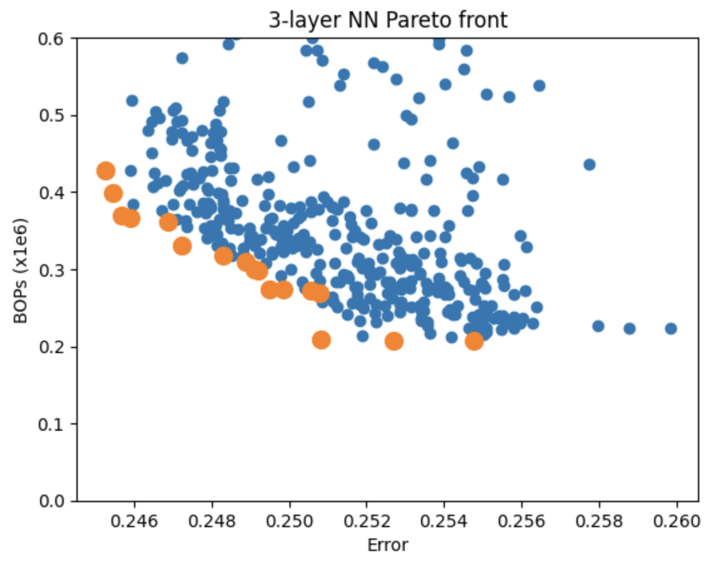

# Sherlock-Q 


## Overview  
For instance, ChatGPT incurs a significant daily cost (~$700K or more) and utilizes around 30K GPUs.

The Sherlock-Q project is about automatically finding efficient quantization configuration, which aims to solve some challenges faced in deploying deep learning models, specifically in computation and memory requirements. The "Q" stands for "Quantization" highlighting the project’s main objective.


## Abstract:
Neural network quantization, critical for efficient network deployment on hardware like FPGAs and ASICs, often requires expert intervention and significant computational resources. This project automates this process using Sherlock-Q, a system developed from the Sherlock design space exploration framework. Sherlock-Q automates hardware quantization of neural networks, minimizing manual intervention and hardware design cycle time. Consequently, it allows more efficient design space exploration for network quantization, reducing the need for hardware experts and computational resources.


## Requirements:
- Python 3.8
- To use this codebase to determine the performance of Sherlock-Q, one must satisfy all requirements. It is recommend that one sets up in an virtual environment to avoid conflicts. All the libraries used are listed in ```requirements.txt```. Run the following command to instlal all required libraries. 

```
pip install -r requirements.txt
```

## Usage: 

Train the 3-layer JetTagger model using the below command

```
python sherlock_optimize.py
```

This will generate two folders:

 1. “checkpoints” which contains the trained models
 2. “metrics” with json files for each trained model containing metrics related to the performance, model size, training curves, etc.


Use the “plot_pareto.ipynb” notebook to generate a plot like the one below.



The graph above illustrates an example choice which results in approximately 80% fewer computations, yet causes less than a 3% drop in accuracy.

## Team Members:
- Goldar Luu
- Kai Yui Yeung
- Vineet Thumuluri
- You Lee

## References: 

Sherlock: 

>Quentin Gautier, Alric Althoff, Christopher L. Crutchfield, and Ryan Kastner. 2022. Sherlock: A Multi-Objective Design Space Exploration Framework. ACM Trans. Des. Autom. Electron. Syst. 27, 4, Article 33 (July 2022), 20 pages. https://doi.org/10.1145/3511472


Jet-Tagger quantization benchmark:
> Campos, Javier, et al. "End-to-end codesign of Hessian-aware quantized neural networks for FPGAs and ASICs." arXiv preprint arXiv:2304.06745 (2023).


